<h3><i class="fas fa-user"></i>Biography</h3>

Wenjin Tao received his PhD degree in the [Innovative Additive Manufacturing Laboratory](http://web.mst.edu/~mstiam/) at [Missouri University of Science and Technology](https://www.mst.edu/), advised by  [Prof. Ming C. Leu](https://web.mst.edu/~mleu/).

He is currently focusing on smart manufacturing system boosted by deep learning & artificial intelligence. His research interests include smart manufacturing, Cyber-Physical System (CPS), Additive Manufacturing (AM) and design optimization.

Before he joined Missouri S&T, he received his Master and Bachelor degrees in Mechanical Engineering at [Beijing Inistitute of Technology](http://english.bit.edu.cn/). 

He is a recipient of [2018 IISE DAIS Track Best Paper Award](http://campaign.r20.constantcontact.com/render?m=1101700049774&ca=ed0c3be7-c33d-4f73-9cbe-2269222b73ca). He has been a student member of [IEEE](https://www.ieee.org/), [IISE](http://www.iise.org/Home/) and [SIAM](<https://www.siam.org/>). Meanwhile, he is a lifelong learner, DIY enthusiast, and passionate about all kinds of new technology like flying car, self-driving car, etc.

<section class="section-intro" id="intro">
  

    

      <h3><i class="fas fa-compass"></i>Interests</h3>
      <ul>        
        <li>Machine Learning and Deep Learning for Human-Centered Intelligent Manufacturing</li>
        <li>Time-Series Signal/Image Recognition</li>
	    <li>Time-Frequency/Spatial-Temporal Data Analysis</li>
        <li>Artificial Intelligence</li>
      </ul>
    
 

    

      <h3><i class="fas fa-user-graduate"></i>Education</h3>
      <ul>
        <li>Ph.D. in Mechanical Engineering Missouri University of Science and Technology</li>
        <li>M.S. in Mechanical Engineering Beijing Institute of Technology</li>
        <li>B.S. in Mechanical Engineering Beijing Institute of Technology</li>
      </ul>
    

  

</section>

<section class="section-projects" id="projects">
<h3><i class="fas fa-microscope"></i>Research Projects</h3>
</section>
#### Cyber-Physical Sensing, Modeling, and Control with Augmented Reality for Smart Manufacturing Workforce Training and Operations Management

  

    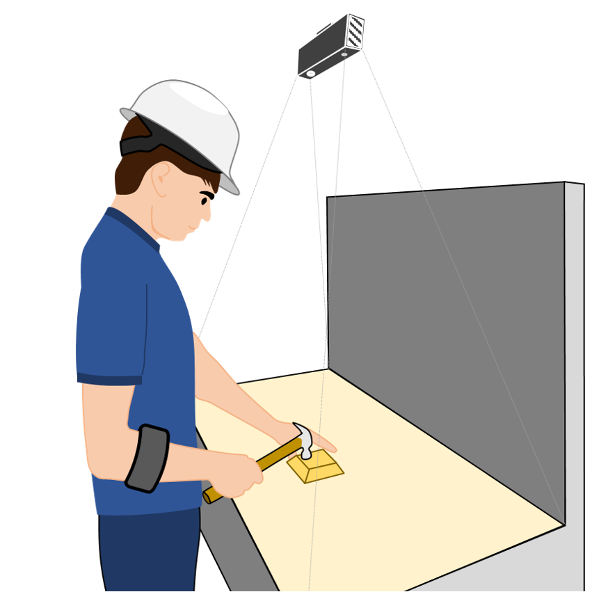
  

  

    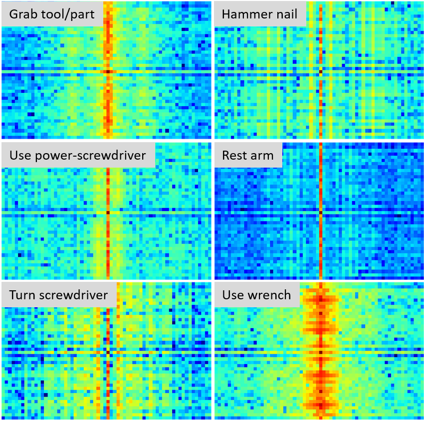
  

  

    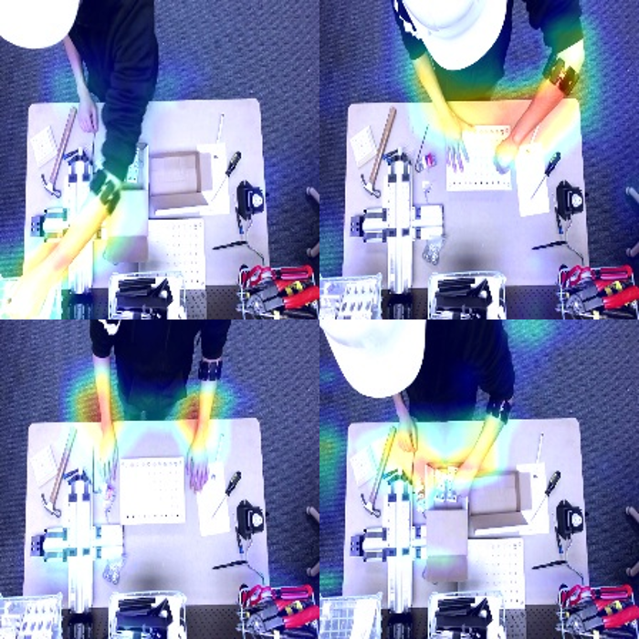
  

Smart manufacturing integrates information, technology, and human ingenuity to inspire the next revolution in the manufacturing industry. Manufacturing has been identified as a key strategic investment area by the U.S. government, private sector, and university leaders to spur innovation and keep America competitive. However, the lack of new methodologies and tools is challenging continuous innovation in the smart manufacturing industry. This award supports fundamental research to develop a cyber-physical sensing, modeling, and control infrastructure, coupled with augmented reality, to significantly improve the efficiency of future workforce training, performance of operations management, safety and comfort of workers for smart manufacturing. Results from this research are expected to transform the practice of worker-machine-task coordination and provide a powerful tool for operations management. This research involves several disciplines including sensing, data analytics, modeling, control, augmented reality, and workforce training and will provide unique interdisciplinary training opportunities for students and future manufacturing engineers.

<a href="https://www.sciencedirect.com/science/article/pii/S235197891830828X?via%3Dihub">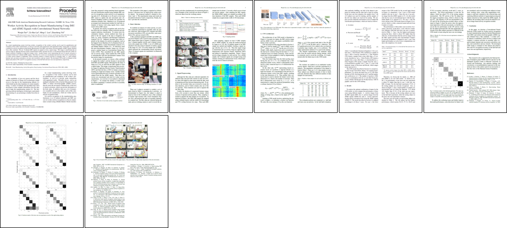</a>

This research work is supported by the [National Science
Foundation grant CMMI-1646162](https://www.nsf.gov/awardsearch/showAward?AWD_ID=1646162) and also by the
[Intelligent Systems Center at Missouri University of
Science and Technology](https://isc.mst.edu/).

#### Multi-View Recognition of Complex Hand Gesture

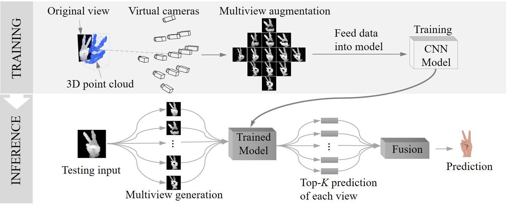

- Considering the challenges of the ASL alphabet recognition task, we choose CNN as the basic model to build the classifier because of its powerful learning ability that has been shown
- To fully exploit the 3D information provided by depth images, we develop a novel multi-view augmentation strategy. It generates more views from different perspectives, in order to augment the perspective variations that cannot be achieved using traditional image augmentation methods 
- To solve the interclass similarity issues caused by perspective variations and partial occlusions, we first make predictions for all individual views and then fuse information from them for the final prediction
- Design and develop a real-time demo of American Sign Language (ASL) alphabet recognition [[demo](https://taowenjin.com/papers/American-sign-language-alphabet-recognition-using-leap-motion-controller.html)] 
- Establish and Publish a dataset of ASL alphabet [[dataset](https://github.com/WenjinTao/ASLA-Leap)]

<a href="https://doi.org/10.1016/j.engappai.2018.09.006">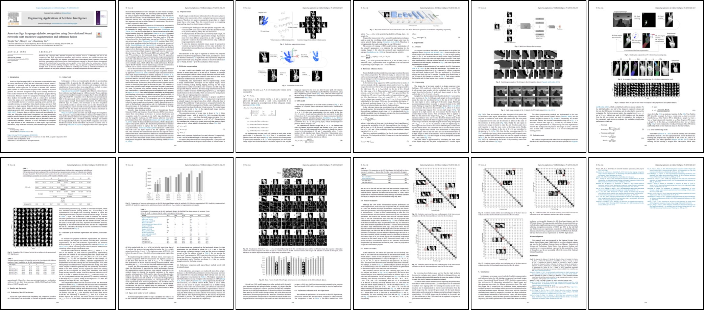</a>

<a href="https://par.nsf.gov/servlets/purl/10083240">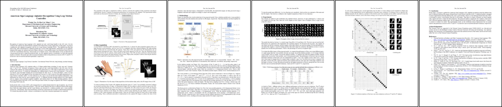</a>

#### Design of Lattice Structure for Additive Manufacturing

  

    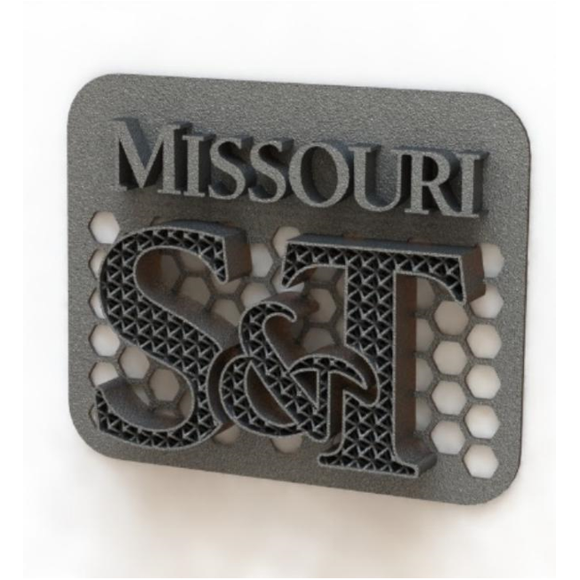
  

  

    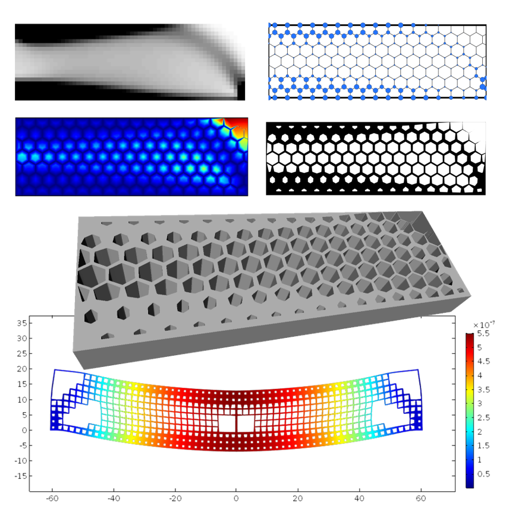
  

  

    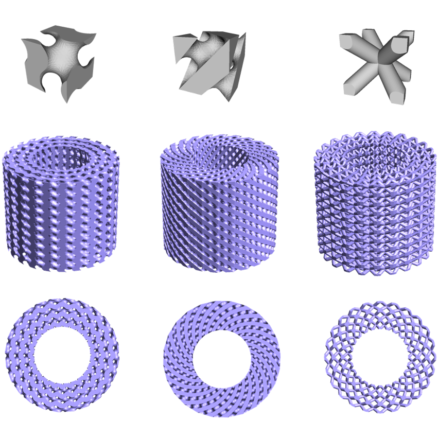
  

  

    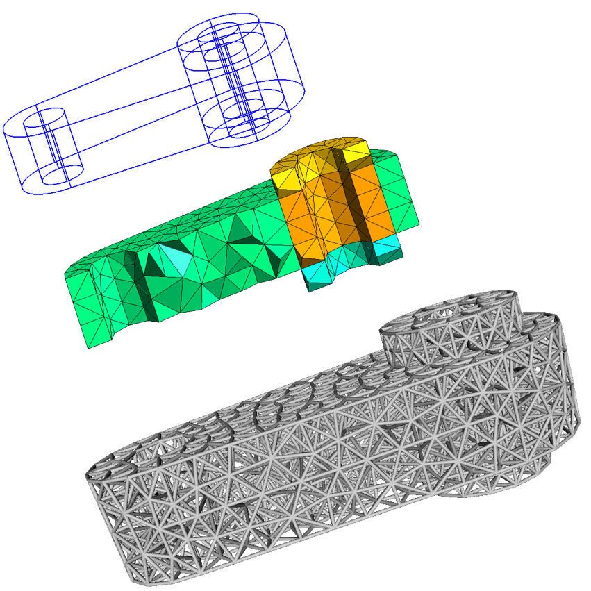
  

Additive Manufacturing (AM) technology provides new opportunities to automatically and flexibly fabricate parts with complicated shapes and architectures that could not be produced by conventional manufacturing processes, thus enabling unprecedented design flexibilities and application opportunities. 

The lattice structure possesses many superior properties to solid material and conventional structures. It is able to integrate more than one function into a physical part, which makes it attractive to a wide range of applications. With AM technology the lattice structure can be fabricated by adding material layer-by-layer directly from a Computer-Aided Design (CAD) model, rather than the conventional processes with complicated procedures. 

AM lattice structures have been intensively studied for more than ten years with significant progress having been made. This [paper](<https://ieeexplore.ieee.org/document/7790182>) reviews and discusses AM processes, design methods and considerations, mechanical behavior, and applications for lattice structures enabled by this emerging technology.

<a href="https://ieeexplore.ieee.org/document/7790182">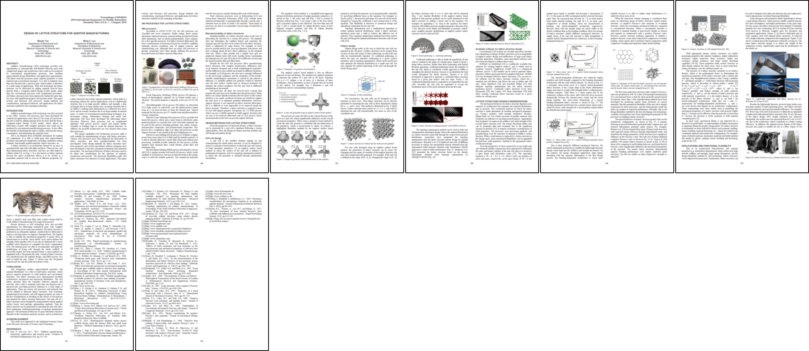</a>

<a href="https://www.jstage.jst.go.jp/article/isfa/2018/0/2018_122/_article/-char/ja/">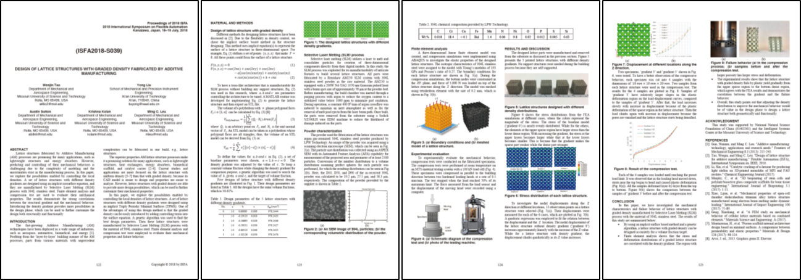</a>

<section class="section-projects" id="projects">
<h3><i class="fas fa-microscope"></i>Other Projects</h3>
</section>
I think getting hands dirty is the best way to learn. Here lists some interesting projects I've done.

#### Deep Learning

- [Predict Bike Sharing Rides](<https://github.com/WenjinTao/Deep-Learning-Foundation-Nanodegree--Udacity/blob/master/P1-Predict_Bike_Sharing_Rides/DLND-your-first-network/dlnd-your-first-neural-network.ipynb>)
- [Image Classification with Convolutional Neural Networks (CNN)](<https://github.com/WenjinTao/Self-Driving-Car-Nanodegree--Udacity/blob/master/Term1/P2-Traffic_Sign_Classifier/Traffic_Sign_Classifier-WenjinTao.ipynb>)
- [Generate TV Scripts with RNN](<https://github.com/WenjinTao/Deep-Learning-Foundation-Nanodegree--Udacity/blob/master/P3-Generate_TV_Scripts/dlnd_tv_script_generation.ipynb>)

- [Language Translation with LSTM](<https://github.com/WenjinTao/language_translation/blob/master/dlnd_language_translation_REVISED.ipynb>)
- [Face Generation with Generative Adversarial Networks (GAN)](<https://github.com/WenjinTao/Deep-Learning-Foundation-Nanodegree--Udacity/blob/master/P5-Face_Generation/dlnd_face_generation.ipynb>)

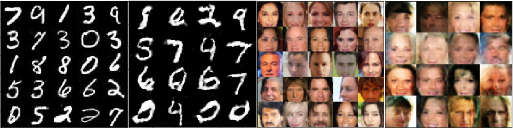

#### Self-Driving Car

- [Finding Lane Lines](<https://github.com/WenjinTao/Self-Driving-Car-Nanodegree--Udacity/blob/master/Term1/P1-Finding_Lane_Lines/P1-Finding_Lane_Lines.ipynb>) 

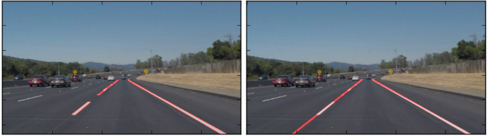

- [Traffic Sign Classifier](<https://github.com/WenjinTao/Self-Driving-Car-Nanodegree--Udacity/blob/master/Term1/P2-Traffic_Sign_Classifier/Traffic_Sign_Classifier-WenjinTao.ipynb>)

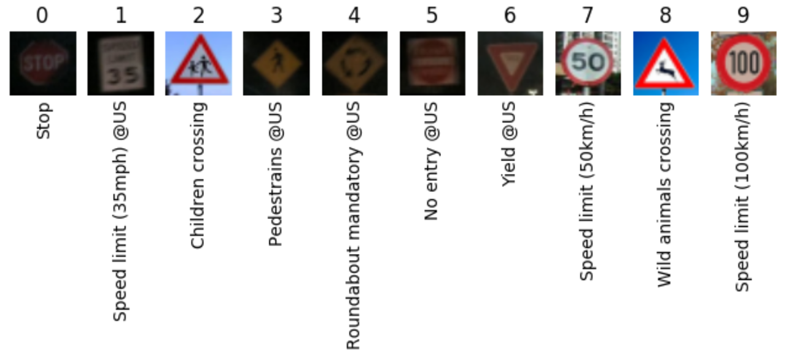

- [Behavioral Cloning](<https://github.com/WenjinTao/Self-Driving-Car-Nanodegree--Udacity/tree/master/Term1/P3-Behavioral_Cloning>) / [demo1](<https://www.youtube.com/watch?v=f8TJ_bV4DKA>) / [demo2](<https://www.youtube.com/watch?v=VcyPwxqqN5E>)

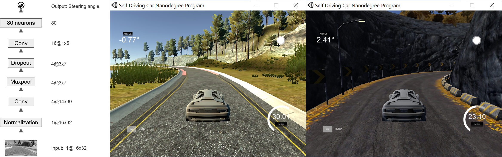

- [Advanced Lane Finding](<https://github.com/WenjinTao/Self-Driving-Car-Nanodegree--Udacity/tree/master/Term1/P4-Advanced_Lane_Finding>) / [demo](<https://www.youtube.com/watch?v=Dc_axsKVrTQ&feature=youtu.be>)

- [Vehicle Detection](<https://github.com/WenjinTao/Self-Driving-Car-Nanodegree--Udacity/tree/master/Term1/P5-Vehicle_Detection>) / [demo1](<https://www.youtube.com/watch?v=RASZZ41Okfc&feature=youtu.be>) / [demo2](<https://www.youtube.com/watch?v=qlcGfB6M48Y&feature=youtu.be>)

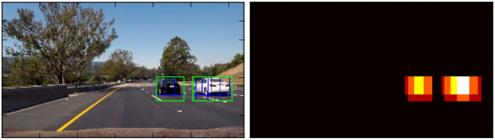

- [Semantic Segmentation Using Fully Convolutional Networks (FCN)](https://github.com/WenjinTao/CarND-Semantic-Segmentation)

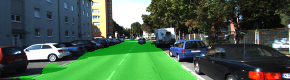

- [Extended Kalman Filter](https://github.com/WenjinTao/Self-Driving-Car-Nanodegree--Udacity/tree/master/Term2/P1-Extended_Kalman_Filters)
- [Unscented Kalman Filter](https://github.com/WenjinTao/Self-Driving-Car-Nanodegree--Udacity/tree/master/Term2/P2-Unscented_Kalman_Filters)
- [Path Following with a PID Controller](https://github.com/WenjinTao/CarND-PID-Control-Project)

#### Flying Car

#### Robotics

- [Search and Sample Return](https://github.com/WenjinTao/RoboND-Rover-Project)

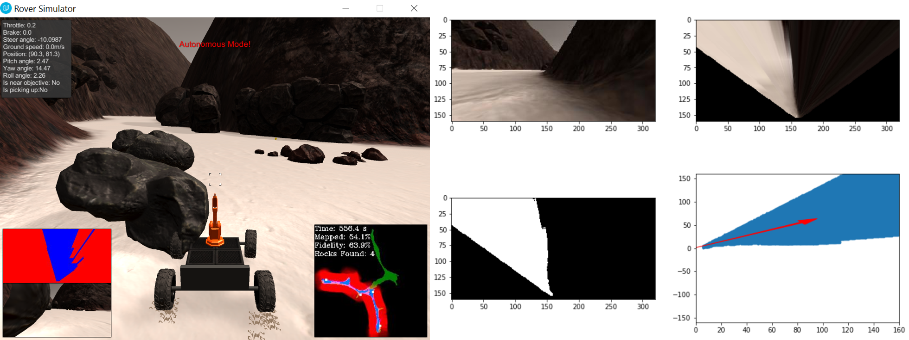

- [Perception with RGBD Camera](https://github.com/WenjinTao/RoboND-Perception-Project/blob/master/writeup_template.md)

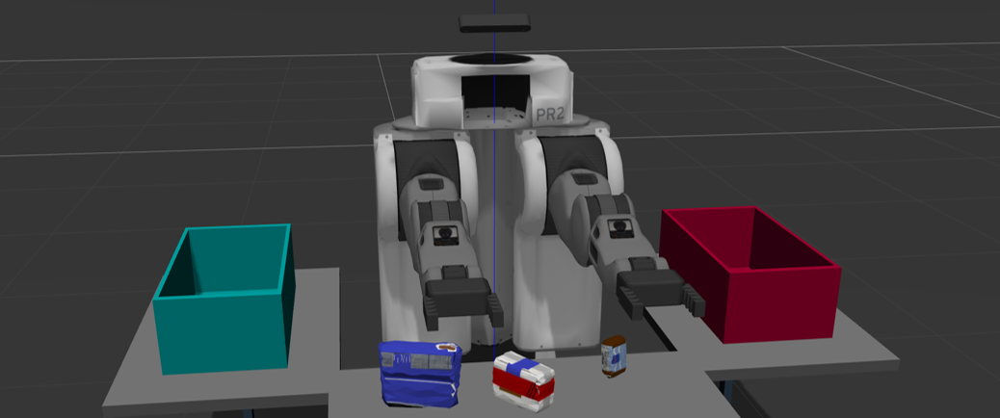

- [Robotic Arm: Pick & Place Using Forward & Inverse Kinematics](https://github.com/WenjinTao/RoboND-Kinematics-Project/blob/master/project_writeup.md)

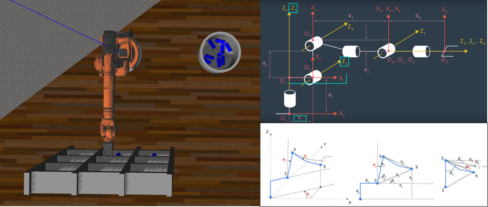

- [Identification and Tracking of Human Target Using Fully Convolutional Networks (FCN)](https://github.com/WenjinTao/RoboND-DeepLearning-Project/blob/master/Write-up.md)

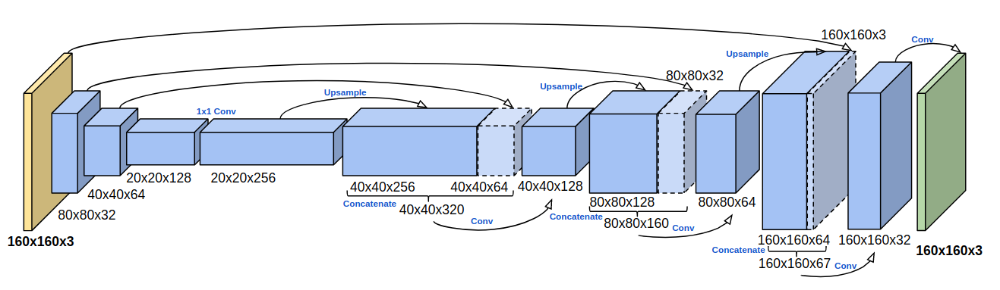

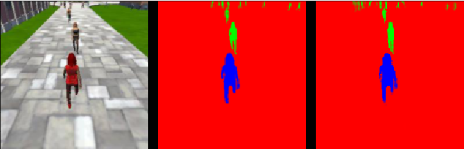

#### Artificial Intelligence

- [Image Classification with CNN in PyTorch](https://github.com/WenjinTao/aipnd-project/blob/master/Image Classifier Project.ipynb)

<section class="section-publications" id="publications">
<h3><i class="fas fa-book"></i>Publications</h3>
</section>

**Journal Papers**
1. **Tao, W.**, Lai, Z. H., Leu, M. C., Yin, Z., & Qin, R. (2019). **A Self-Aware and Active-Guiding Training System for Worker-Centered Intelligent Manufacturing**. Manufacturing Letters. (Accepted)
2. **Tao, W.**, Leu, M. C., & Yin, Z. (2019). **Multi-Modal Recognition of Worker Activity for Human-Centered Intelligent Manufacturing**. (*Submitted to the Journal of Manufacturing Systems*)
3. **Tao, W.**, Moniruzzaman, M., Leu, M. C., Yin, Z., & Qin, R. (2019). **Attention-Based Sensor Fusion for Human Activity Recognition Using IMU Signals**. (*Submitted to the journal of Information Fusion*)
4. Lai, Z. H., **Tao, W.\***, Leu, M. C., & Yin, Z. (2019). **Smart Augmented Reality Instructional System for
   Mechanical Assembly Towards Worker-Centered Intelligent Manufacturing**. (*Submitted to the Journal of Manufacturing Systems*)
5. **Tao, W.**, Leu, M.C. and Yin, Z., 2018. **American Sign Language alphabet recognition using Convolutional Neural Networks with multiview augmentation and inference fusion**. Engineering Applications of Artificial Intelligence, 76, pp.202-213. [Preprint](assets/papers/American Sign Language alphabet recognition using Convolutional Neural Networks with multiview augmentation and inference fusion.pdf) [Cite](https://doi.org/10.1016/j.engappai.2018.09.006)
6. Shen, J., Li, G., Yan, W., **Tao, W.**, Xu, G., Diao, D., & Green, P. (2018). **Nighttime driving safety
   improvement via image enhancement for driver face detection**. IEEE Access, 6, 45625-45634.
7. Wei, C., Chen, G., Luan, Z., **Tao, W.*** (2016). **Optimization on the Hydrodynamic Groove Geometry of Rotary Seals for Automotive Transmissions**. Transactions of Beijing Institute of Technology 36 (1), 25-30.
8. Qiao, J., **Tao, W.**, & Sun, B. (2012). **Design for the Braking System of a FSAE Racing Car** [J]. Chinese Journal of Automotive Engineering, 2. 
9. Wei, W., **Tao, W.**, & Yan, Q. (2010). **Exploratory discussion on virtual laboratory teaching information platform system based on visual simulation technique**. Experimental Technology and Management, 27(3), 78-81.

**Peer-Reviewed Conference Papers**

1. Al-Amin, M., **Tao, W.**, Doell, D., Lingard, R., Yin, Z., Leu, M. C., & Qin, R. (2019, August). **Action Recognition in Manufacturing Assembly using Multimodal Sensor Fusion**. 25th International Conference on Production Research Manufacturing Innovation: Cyber Physical Manufacturing, August 9–14, 2019 Chicago, Illinois, USA.
2. **Tao, W.**, Lai, Z.H., Leu, M.C. and Yin, Z., 2018. **Worker Activity Recognition in Smart Manufacturing Using IMU and sEMG Signals with Convolutional Neural Networks**. Procedia Manufacturing, 26, pp.1159-1166. [Preprint](https://wvvw.easychair.org/publications/preprint_open/gdT5) [Project](#) [Cite](https://doi.org/10.1016/j.promfg.2018.07.152)
3. **Tao, W.**, Lai, Z.H., Leu, M.C. and Yin, Z., 2018. **American Sign Language Alphabet Recognition Using Leap Motion Controller** ([IISE Annual 2018, Data Analytics & Information Systems Division Best Track Paper Award](http://campaign.r20.constantcontact.com/render?m=1101700049774&ca=ed0c3be7-c33d-4f73-9cbe-2269222b73ca)) [Preprint](http://amz.xcdsystem.com/C5AB9227-CA78-AE70-2946FDB80F96639A_abstract_File8390/FinalPaper_1720_0306092921.pdf) [Project](papers/American-sign-language-alphabet-recognition-using-leap-motion-controller.html)
4. Wu, S., **Tao, W.\***, Leu, M. C., & Long, S. (2018). **Engine Sound Simulation and Generation in Driving Simulator**. In Proceedings of the 2018 Institute of Industrial and Systems Engineers Annual Conference (IISE 2018).
5. Al-Amin, M., Qin, R., **Tao, W.**, & Leu, M. C. (2018, January). **Sensor Data Based Models for Workforce Management in Smart Manufacturing**. In Proceedings of the 2018 Institute of Industrial and Systems Engineers Annual Conference (IISE 2018).
6. Hu, L., Nguyen, N.T., **Tao, W.\***, Leu, M.C., Liu, X.F., Shahriar, M.R. and Al Sunny, S.N., 2018. **Modeling of cloud-based digital twins for smart manufacturing with MT connect**. Procedia Manufacturing, 26, pp.1193-1203.
7. **Tao, W.**, Liu, Y., Sutton, A., Kolan K. and Leu, M.C., 2018. **Design of Lattice Structures with Graded Density Fabricated by Additive Manufacturing**. [Preprint](https://wvvw.easychair.org/publications/preprint_open/L9DR)
8. **Tao, W.**, & Leu, M. C. (2016, August). **Design of lattice structure for additive manufacturing**. In 2016 International Symposium on Flexible Automation (ISFA) (pp. 325-332). IEEE.

**Books & Book Chapters**

1. **NX 12 for Engineering Design**. Leu, M. C., **Tao, W.***, Ghazanfari, A., & Kolan, K. (2017). Department of Mechanical and Aerospace Engineering, Missouri University of Science and Technology. [eBook](assets/books/NX 12 for Engineering Design.pdf)
1. **Manufacturing Assembly Simulations in Virtual and Augmented Reality**. **Tao, W.**, Lai, Z. H., & Leu, M. C. (2018). Augmented, Virtual, and Mixed Reality Applications in Advanced Manufacturing. [Accepted Draft](assets/books/Manufacturing Assembly Simulations in Virtual and Augmented Reality.pdf)
1. **Virtual Bone Surgery**. Leu, M. C., **Tao, W.**, Niu, Q., & Chi, X. (2018**).** In Virtual Prototyping & Bio Manufacturing in Medical Applications (2nd Edition). Springer, Boston, MA under review

**Patents**
1. A Novel Method for Analyzing the Wear of Rotary Seal with Micro-textured Contacting Surface. Wei, C., Zhao, Y., Hu, J., Yuan, S., & Tao, W. (2015). CN104679990A
2. A Novel Optimization Method for Designing of Rotary Seal in Automotive Transmission. Wei, C., Hu, J., Tao, W., & Chen, G. (2014). CN103955581A
3. A Novel Rotary Seal with Wavy Contacting Surface for Automotive Transmissions. Hu, J., Tao, W., Yuan, S., & Wei, C. (2012). CN102797854A
4. A Self-adaptive Deformable Wing for Racing Cars. Xiang, C., Xu, B., Tao, W., & Lou, R. (2011). CN102248968B

*[Google Scholar](https://scholar.google.com/citations?user=jIQocKAAAAAJ&hl=en) for a full list.*

<section class="section-teaching" id="teaching">
<h3><i class="fas fa-chalkboard-teacher"></i>Teaching & Mentoring Experience</h3>
</section>

I am a teaching instructor for the following courses at Missouri University of Science and Technology
- Fall 2018: ME 5763: Computer Aided Design: Theory and Practice / [Course Site](https://me5763.github.io/lab) / [Book](./assets/books/NX 12 for Engineering Design.pdf) / [YouTube Channel](<https://www.youtube.com/channel/UChYht2a_KxGdqqJBQ00m4lA/videos?view_as=subscriber>) / [Vimeo](<https://vimeo.com/channels/1412220>)
- Fall 2017: ME 5763: Principles And Practice Of Computer Aided Design
- Fall 2016: ME 5763: Principles And Practice Of Computer Aided Design

<section class="section-talk" id="talk">
<h3><i class="fas fa-chalkboard-teacher"></i>Invited Talk</h3>
</section>

- Human Behavior Understanding for Worker-Centered Intelligent Manufacturing. Xi'an University of Technology, Dec. 2018

<section class="section-reviews" id="reviews">
<h3><i class="fas fa-search"></i>Reviews</h3>
</section>
Active Reviewer for
- The journal of [Artificial Intelligence](https://publons.com/journal/947/artificial-intelligence)
- The journal of [Engineering Applications of Artificial Intelligence](https://www.journals.elsevier.com/engineering-applications-of-artificial-intelligence)
- The journal of [IEEE Transactions on Intelligent Transportation Systems](https://publons.com/journal/1368/ieee-transactions-on-intelligent-transportation-sy)
- The journal of Advanced Manufacturing Technology
- [IISE Annual Conference 2018](https://publons.com/journal/78635/iise-annual-conference)
- [The 46th North American Research Conference](http://www.sme.org/namrc46/)

*[Publons Profile](<https://publons.com/researcher/1349420/wenjin-tao/>)*

<section class="section-awards" id="awards">
<h3><i class="fas fa-award"></i>Honors & Awards</h3>
</section>

- [Data Analytics & Information Systems Division Best Track Paper Award, IISE Annual 2018](http://campaign.r20.constantcontact.com/render?m=1101700049774&ca=ed0c3be7-c33d-4f73-9cbe-2269222b73ca)
- NSF Travel Grant, IISE Annual conference, 2018
- NSF Travel Grant, ISFA conference, 2016
- Award in the Innovation Cup of Science Popularization, 2012
- Outstanding Student Leader in the School of Mechanical Engineering at BIT, 2012
- The Final Champion in 2011 Formula Student Competition China, 2011
- Qualification Certificate of Automotive Specialized Technique by SAE of China, 2011
- The Final Champion in 2010 Formula Student Competition China, 2010
- Beijing Outstanding Graduate, 2010
- The First Prize of FAST Scholarship, 2010
- The DEC Scholarship, 2010
- National Scholarship, 2009
- The University Award for 6 times at BIT, 2006-2010

<section class="section-activities" id="activities">
<h3><i class="fas fa-user-friends"></i>Service Activities</h3>
</section>
- Presenting for visitors Profs. Jihong Yan and Chaozhong Guo from Harbin Institute of Technology, Oct. 5, 2018
- Presenting for visitor [Prof. Kon-Well Wang](https://me.engin.umich.edu/people/faculty/kon-well-wang) from University of Michigan, Sep. 24, 2018
- Presenting for visitor [Prof. Wei Zhao](https://www.aus.edu/faculty/dr-wei-zhao) from the American University of Sharjah, UAE, Aug. 6, 2018
- Presenting for visitors from [Brewer Science](https://www.brewerscience.com/), Aug. 7, 2018
- Presenting for [Prof. Dazhong Wu](http://mae.ucf.edu/dazhong-wu/) from University of Central Florida, Jul. 20, 2018
- Presenting and instructing driving simulator expericing for the [National Society of Black Engineers (NSBE) Pre-College Initiative (PCI) Weekend](https://inspire-utc.mst.edu/news/), Feb. 24, 2018
- Presenting for [Missouri S&T Industry Day](https://news.mst.edu/2017/08/sept-25-is-industry-day-at-missouri-st/), Sep. 25, 2017
- Mentoring student from the [REU program](https://nsf.gov/awardsearch/showAward?AWD_ID=1461102), Summer, 2015 

<section class="section-posts" id="posts">
<h3><i class="fas fa-folder-open"></i>Miscellaneous</h3>
</section>

- [Design of Functional Lattice Structure with Density Variable Density Distribution for Additive Manufacturing](posts/2016-11-19-variable-density-lattice.html)
- [Slice-based 3D Lattice Structure Generation for Additive Manufacturing](posts/2016-09-16-slice-based.html)
- [3D Lattice Structure with Variable Density Distribution](posts/2016-07-21-3d-variable-density-lattice.html)
- [DEM & Ray Tracing Simulation of SLM Process](posts/2016-06-21-dem-ray-tracing.html)

