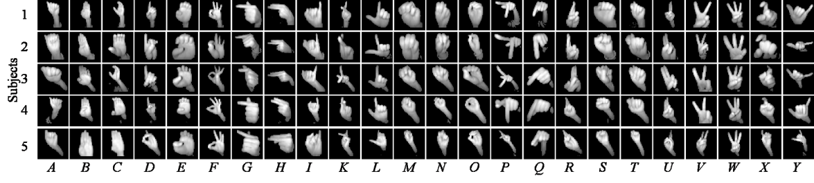

**
Wenjin Tao, Ze-Hao Lai, Ming C. Leu, Zhaozheng Yin
**

Missouri University of Science and Technology, Rolla, MO 65409, USA

 

<iframe width="560" height="315" src="https://www.youtube.com/embed/5uTERr6H1R4" frameborder="0" allow="autoplay; encrypted-media" allowfullscreen></iframe>

### Abstract

Recognition of American Sign Language (ASL) alphabet not only could bring benefits to the ASL users, but also could provide solutions for natural human-computer/robot interactions in many applications. In this paper, we propose a method for ASL alphabet recognition with use of a Leap Motion Controller (LMC).  The skeleton data from the native LMC API is transformed by a skeleton module into a vector of the angle features. Meanwhile, two raw infrared-radiation (IR) images are captured and each of them is fed into a vision module using a Convolutional Neural Network (CNN) for visual feature extraction, which results in two feature vectors. Those three feature vectors are then fed into a fusion neural network to output the predicted label. An ASL alphabet dataset is established, on which the proposed model is evaluated. The results show that our proposed method achieves the prediction accuracies of 80.1% and 99.7% in the leave-one-out and the half-half experiments, respectively.

### Paper

American Sign Language Alphabet Recognition Using Leap Motion Controller (IISE Annual 2018, Data Analytics & Information Systems Division Best Track Paper Award) [PDF]

### Dataset

Please contact [w.tao@mst.edu](mailto:w.tao@mst.edu) to get the dataset.

    <iframe width="560" height="315" src="https://www.youtube.com/embed/klosWqN2f_Y" frameborder="0" allow="autoplay; encrypted-media" allowfullscreen></iframe>

