

<section class="page-intro">
  
Selected Work

  <h1 class="page-title">Projects across robotics, industrial vision, and factory software</h1>
  

    These projects sit close to operations. They are the kind of systems where product
    definition, hardware constraints, software execution, and user adoption all matter.
  

</section>

<section id="project-categories">
  <h2>Project Categories</h2>
  

    <button class="filter-btn active" data-filter="all">All Projects</button>
    <button class="filter-btn" data-filter="robotics">Robotics</button>
    <button class="filter-btn" data-filter="computer-vision">Computer Vision</button>
    <button class="filter-btn" data-filter="healthcare">Healthcare</button>
    <button class="filter-btn" data-filter="workflow">Digital Workflow</button>
    <button class="filter-btn" data-filter="analytics">AI Analytics</button>
    <button class="filter-btn" data-filter="research">Research</button>
  

</section>

<section id="projects-showcase">
  

    <!-- Field Robotics -->
    

      

        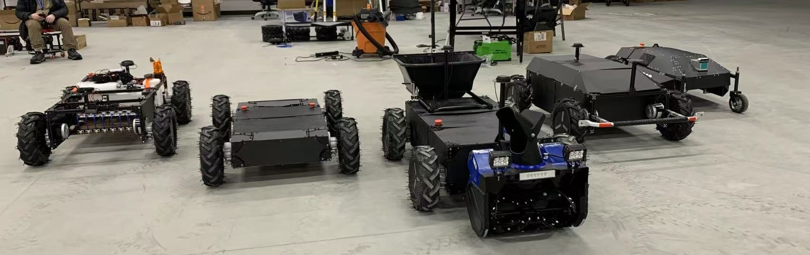
        
Robotics

      
      

        <h3>Field Robotics</h3>
        

          A modular, zero-emission robot platform with self-driving capabilities and tool attachments such as lawn mowers, snow plows, and weed controllers. Designed for cost-effective, sustainable outdoor labor.
        

        

          <h3>Key Features</h3>
          <ul>
            <li>Self-driving technology powered by advanced sensors and AI algorithms</li>
            <li>Modular design supporting multiple tool attachments</li>
            <li>Zero-emission operation for reduced environmental impact</li>
            <li>Rugged construction for all-weather operation</li>
          </ul>
          <!-- <h3>Technologies Used</h3>
          

            Jetson Nano
            ArduPilot
            ROS
            Computer Vision
          
 -->
          

            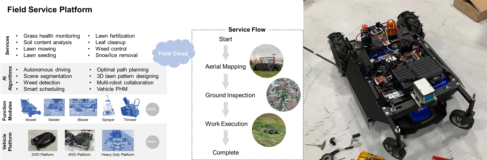
            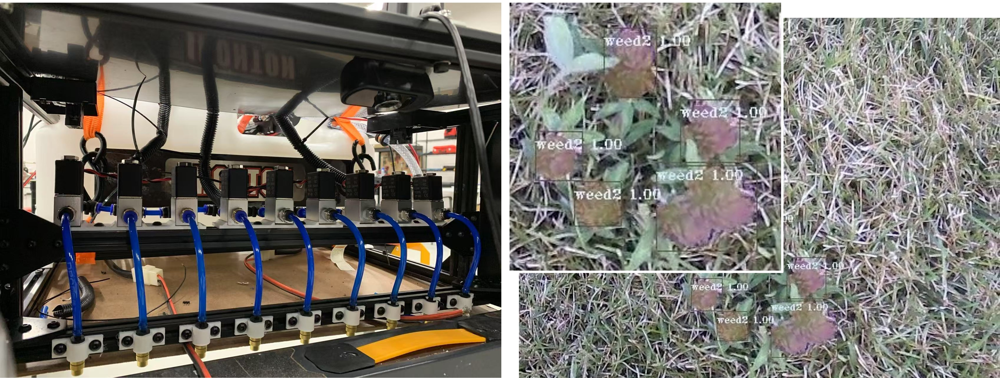
            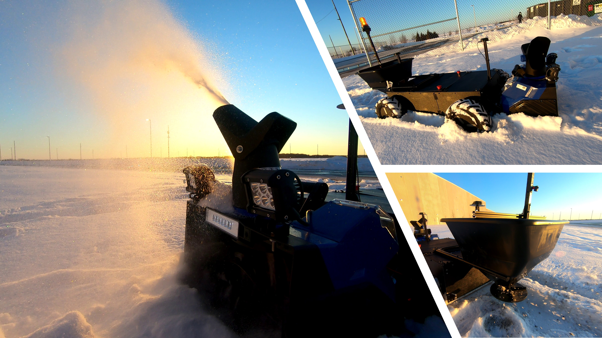
          

        

      

    

    <!-- Low-Cost Ventilator -->
    

      

        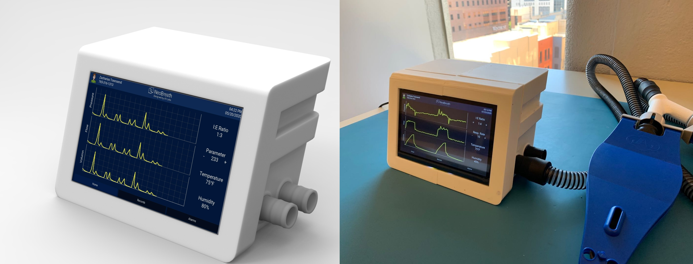
        
Healthcare

      
      

        <h3>Low-Cost Ventilator Prototype</h3>
        

          Designed to be built with off-the-shelf and 3D-printed parts, this ventilator supports emergency medical needs while demonstrating the team's rapid-response engineering and future AI integration potential.
        

        

          <h3>Key Features</h3>
          <ul>
            <li>Built with readily available components</li>
            <li>3D-printed custom parts for easy replication</li>
            <li>Full control loop for pressure and volume regulation</li>
            <li>Low-cost design for emergency deployment</li>
          </ul>
          <!-- <h3>Technologies Used</h3>
          

            Arduino
            3D Printing
            Control Systems
            Medical Electronics
          
 -->
          

            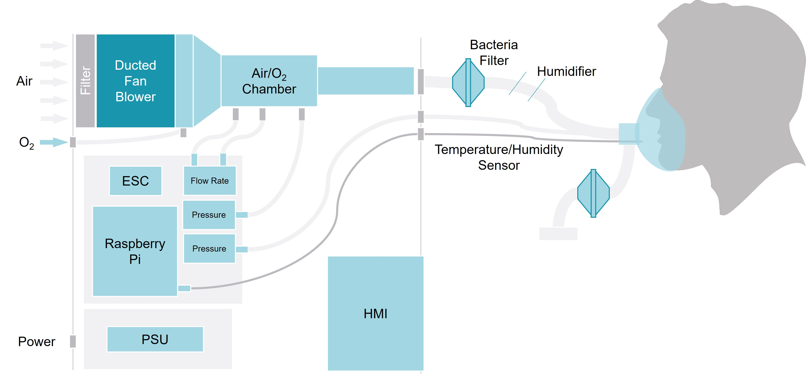
            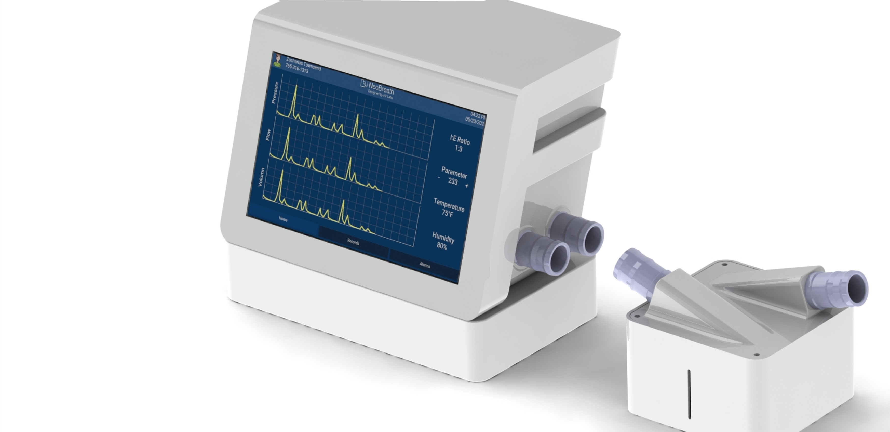
          

        

      

    

    <!-- Mask Defect Detection -->
    

      

        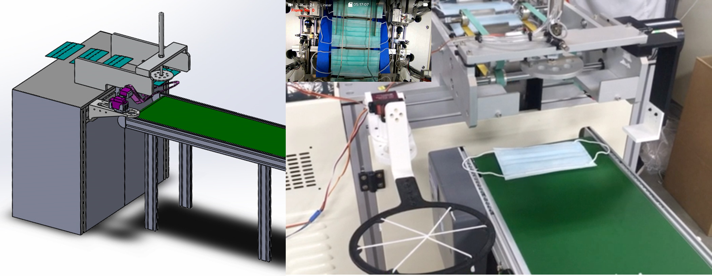
        
Computer Vision

      
      

        <h3>Mask Defect Detection System</h3>
        

          Uses image processing and machine learning to detect manufacturing defects in face masks and automatically sort them, improving quality assurance and traceability.
        

        

          <h3>Key Features</h3>
          <ul>
            <li>Real-time defect detection on production lines</li>
            <li>93% classification accuracy</li>
            <li>Automated sorting mechanism</li>
            <li>Production data logging for quality traceability</li>
          </ul>
          <!-- <h3>Technologies Used</h3>
          

            OpenCV
            TensorFlow
            PyTorch
            Industrial Cameras
          
 -->
        

      

    

    <!-- Pin Defect Detection -->
    

      

        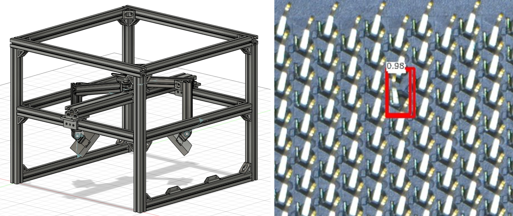
        
Machine Vision

      
      

        <h3>Pin Defect Detection System</h3>
        

          Automatically identifies bent or damaged pins in dense electronic components using AI, helping quality teams detect issues early and improve yield.
        

        

          <h3>Key Features</h3>
          <ul>
            <li>High-resolution imaging of dense component pin arrays</li>
            <li>Detection algorithm specialized for small defects</li>
            <li>Real-time quality alerts</li>
            <li>Integration with factory quality systems</li>
          </ul>
          <!-- <h3>Technologies Used</h3>
          

            Deep Learning
            Image Processing
            NVIDIA Hardware
            MES Integration
          
 -->
        

      

    

    <!-- FOLO -->
    

      

        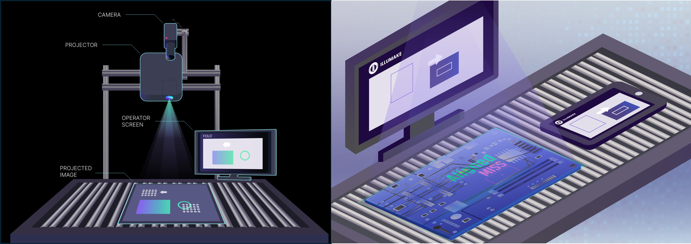
        
Digital Workflow

      
      

        <h3>FOLO: Smart Work Instruction System</h3>
        

          Engineers build digital SOPs via drag-and-drop, while operators follow guided workflows. FOLO records production data and supports hardware integration.
        

        

          <h3>Key Features</h3>
          <ul>
            <li>Drag-and-drop SOP editor for engineers</li>
            <li>Step-by-step guided workflows for operators</li>
            <li>Production data capture and analysis</li>
            <li>Hardware integration capabilities</li>
          </ul>
          <!-- <h3>Technologies Used</h3>
          

            React.js
            Node.js
            MongoDB
            REST APIs
          
           -->
          

            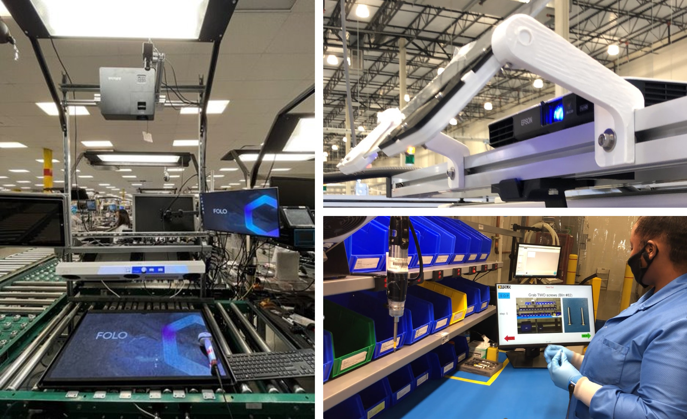
            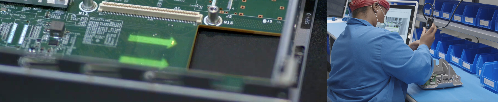
          

        

      

    
   
    <!-- OPTIMO -->
    

      

        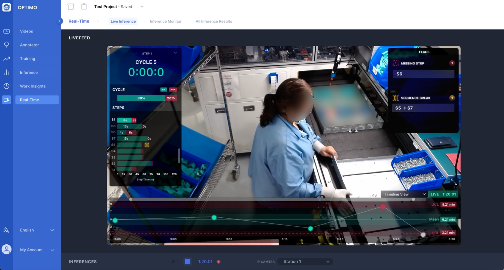
        
AI Analytics

      
      

        <h3>OPTIMO: AI-Driven Human Operation Analytics</h3>
        

          Streams and analyzes IP camera feeds for time-motion analysis and AI training. Features dashboards for performance insights and industrial process optimization.
        

        

          <h3>Key Features</h3>
          <ul>
            <li>IP camera integration and video streaming</li>
            <li>Time-motion analysis algorithms</li>
            <li>Real-time performance dashboards</li>
            <li>AI model training from captured data</li>
          </ul>  
          <!-- <h3>Technologies Used</h3>
          

            Computer Vision
            TensorFlow
            Flask
            WebRTC
          
 -->
          

            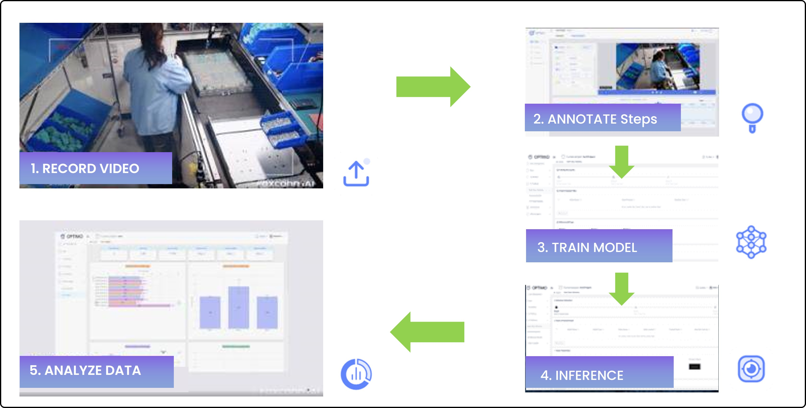
            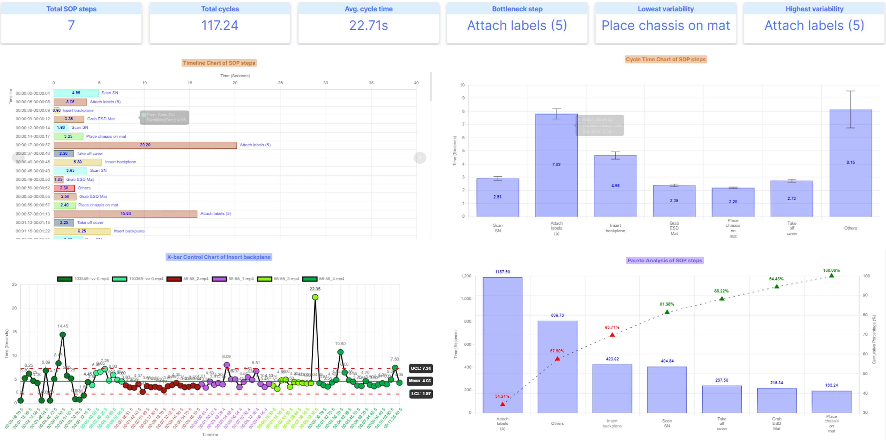
          

        

      

    

  

</section>

<section id="more-projects">
  <h2>Research Projects</h2>
  
  

    <!-- ASL Recognition -->
    

      

        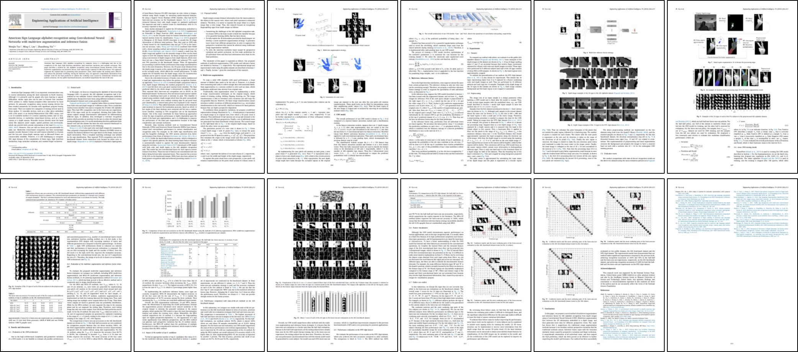
        
Research

      
      

        <h3>Multi-View Recognition of Complex Hand Gesture</h3>
        

          Development of a novel multi-view augmentation strategy for American Sign Language (ASL) alphabet recognition using convolutional neural networks.
        

        

          <a href="https://doi.org/10.1016/j.engappai.2018.09.006" class="project-link" target="_blank" rel="noopener noreferrer">
            <i class="fas fa-file-alt"></i> Paper
          </a>
          <a href="https://github.com/WenjinTao/ASLA-Leap" class="project-link" target="_blank" rel="noopener noreferrer">
            <i class="fab fa-github"></i> Dataset
          </a>
          <!-- <a href="/papers/American-sign-language-alphabet-recognition-using-leap-motion-controller.html" class="project-link">
            <i class="fas fa-play-circle"></i> Demo
          </a> -->
        

      

    

    <!-- Lattice Structure -->
    

      

        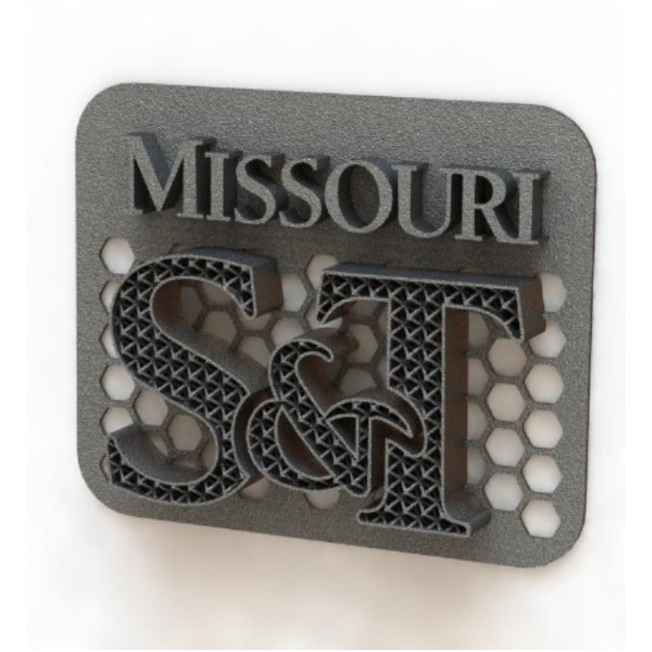
        
Research

      
      

        <h3>Design of Lattice Structure for Additive Manufacturing</h3>
        

          Research on the design and optimization of lattice structures for additive manufacturing, focusing on variable density distribution and mechanical properties.
        

        

          <a href="https://ieeexplore.ieee.org/document/7790182" class="project-link" target="_blank" rel="noopener noreferrer">
            <i class="fas fa-file-alt"></i> Paper
          </a>
        

      

    

  

</section>

<!-- <section id="contact">
  <h2>Get In Touch</h2>
  
  
I'm open to collaboration, speaking invitations, and nerdy conversations about AI in manufacturing.

  
  

    

      <a href="mailto:your@email.com" class="contact-link"><i class="fas fa-envelope"></i> Email Me</a>
      <a href="https://www.linkedin.com/in/yourprofile" class="contact-link"><i class="fab fa-linkedin"></i> LinkedIn</a>
      <a href="/assets/Wenjin_Tao_Resume.pdf" class="contact-link"><i class="fas fa-file-pdf"></i> Resume PDF</a>
    

    
    
Based in Milwaukee, WI — available for remote collaboration and speaking opportunities.

  

</section> -->

